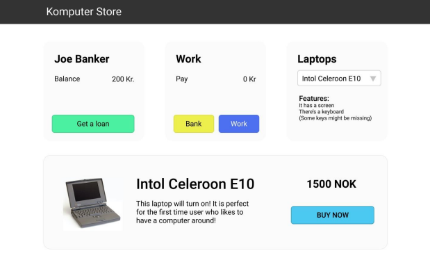

# Assignement-1-Computer

Computer store program for buying computer from salary.

The Bank – an area where you will store funds and make bank loans

Work – an area to increase your earnings and deposit cash into your bank balance

Laptops – an area to select and display information about the merchandise

